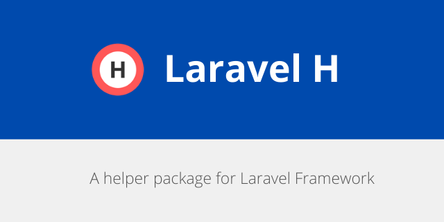

<h1 align="center">Laravel H</h1>

    
    
     
    
    

A helper package for Laravel Framework.

### Documentation
Get full documentation of [Laravel H](https://laravelarticle.com/laravel-h)

### Other Packages
- [Laravel Log Reader](https://github.com/haruncpi/laravel-log-reader) - A simple and beautiful laravel log reader
- [Laravel User Activity](https://github.com/haruncpi/laravel-user-activity) - Monitor application user activity easily!
- [Laravel ID generator](https://github.com/haruncpi/laravel-id-generator) - A laravel package for custom database ID generation.
- [Laravel Simple Filemanager](https://github.com/haruncpi/laravel-simple-filemanager) - A simple filemanager for Laravel.
- [Laravel Option Framework](https://github.com/haruncpi/laravel-option-framework) - Option framework for Laravel.